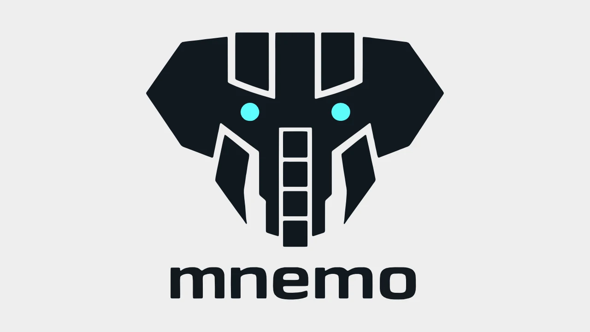

# Mnemo

<p align="center">
  
</p>

[](https://github.com/watzon/mnemo/actions)
[](LICENSE)
[](https://www.rust-lang.org)
[](https://github.com/RichardLitt/standard-readme)

A transparent HTTP proxy that gives your LLM long-term memory.

Mnemo is a Rust daemon that sits between your chat client and LLM APIs (OpenAI and Anthropic), automatically injecting relevant memories into system prompts and capturing assistant responses for future recall. It uses semantic search with local embeddings to retrieve contextually relevant information without modifying your existing workflow.

## Table of Contents

- [Background](#background)
- [Install](#install)
  - [Prerequisites](#prerequisites)
  - [From Source](#from-source)
  - [Using Cargo](#using-cargo)
- [Usage](#usage)
  - [Starting the Daemon](#starting-the-daemon)
  - [Configuring Your Client](#configuring-your-client)
  - [Dynamic Passthrough](#dynamic-passthrough)
  - [Provider Detection](#provider-detection)
  - [Memory Injection](#memory-injection)
  - [CLI Commands](#cli-commands)
- [Configuration](#configuration)
  - [Config File Locations](#config-file-locations)
  - [Storage Configuration](#storage-configuration)
  - [Proxy Configuration](#proxy-configuration)
  - [Router Configuration](#router-configuration)
  - [Embedding Configuration](#embedding-configuration)
  - [Deterministic Retrieval](#deterministic-retrieval)
- [Architecture](#architecture)
  - [System Overview](#system-overview)
  - [Memory Types](#memory-types)
  - [Storage Tiers](#storage-tiers)
  - [Request Flow](#request-flow)
  - [Project Structure](#project-structure)
- [Integrations](#integrations)
- [Examples](#examples)
- [Development](#development)
  - [Building](#building)
  - [Testing](#testing)
  - [Code Quality](#code-quality)
- [API](#api)
  - [HTTP Endpoints](#http-endpoints)
  - [Memory Injection Format](#memory-injection-format)
- [Maintainers](#maintainers)
- [Contributing](#contributing)
- [License](#license)

## Background

Large Language Models have no persistent memory between sessions. Every conversation starts fresh, requiring users to repeatedly provide context about their preferences, projects, and past interactions. This creates friction and limits the usefulness of AI assistants for long-term work.

Mnemo solves this by acting as a transparent proxy between your applications and LLM APIs. It:

1. **Captures** assistant responses and stores them as searchable memories
2. **Retrieves** relevant memories using semantic search when new requests arrive
3. **Injects** those memories into the system prompt before forwarding to the LLM
4. **Manages** memory lifecycle with tiered storage, compaction, and eviction

The name "Mnemo" comes from Mnemosyne, the Greek goddess of memory and mother of the Muses.

### Key Features

- **Transparent Proxy**: Drop-in replacement for LLM API endpoints—no client changes needed
- **Multi-Provider Support**: Native support for OpenAI and Anthropic APIs with automatic provider detection
- **Dynamic Passthrough**: Route to any provider via `/p/{url}` without configuration changes
- **Local Embeddings**: Uses e5-small (384 dimensions) via fastembed—no external API calls for embeddings
- **Entity Extraction**: DistilBERT-NER extracts and indexes entities for better retrieval
- **Three-Tier Storage**: Hot (memory), Warm (disk), Cold (archive) with automatic migration
- **Weight-Based Retention**: Important memories persist longer; less relevant ones decay
- **Progressive Compression**: Full → Summary → Keywords → Hash to optimize storage
- **Streaming Support**: Full SSE streaming with zero-latency response capture
- **Fail-Open Design**: Memory errors never block requests—always passes through to upstream

## Install

### Prerequisites

- **Rust 1.85 or later** (Edition 2024)
- **4GB RAM minimum** (for embedding and NER models)
- **~500MB disk space** for models and initial data

The first run downloads approximately 100MB of ML models (fastembed e5-small and DistilBERT-NER).

### From Source

```bash
# Clone the repository
git clone https://github.com/watzon/mnemo.git
cd mnemo

# Build release binaries (optimized with LTO)
cargo build --release

# Install binaries to your PATH
cp target/release/mnemo /usr/local/bin/
cp target/release/mnemo-cli /usr/local/bin/
```

### Using Cargo

```bash
cargo install mnemo mnemo-cli
```

## Usage

### Starting the Daemon

```bash
# Start with default config location
mnemo

# Start with custom config file
mnemo --config /path/to/config.toml

# Start with debug logging
RUST_LOG=debug mnemo
```

The daemon listens on `127.0.0.1:9999` by default and supports graceful shutdown via SIGTERM or Ctrl+C.

### Configuring Your Client

Point your LLM client to the Mnemo proxy instead of the direct API:

```bash
# Instead of:
export OPENAI_BASE_URL="https://api.openai.com/v1"

# Use:
export OPENAI_BASE_URL="http://127.0.0.1:9999"
```

Most clients (OpenAI SDK, LangChain, Anthropic SDK, etc.) respect base URL environment variables.

### Dynamic Passthrough

Route requests to any LLM provider without changing configuration using the `/p/{url}` endpoint:

```bash
# OpenAI
curl http://localhost:9999/p/https://api.openai.com/v1/chat/completions \
  -H "Authorization: Bearer $OPENAI_API_KEY" \
  -H "Content-Type: application/json" \
  -d '{"model": "gpt-4", "messages": [{"role": "user", "content": "Hello"}]}'

# Anthropic
curl http://localhost:9999/p/https://api.anthropic.com/v1/messages \
  -H "x-api-key: $ANTHROPIC_API_KEY" \
  -H "anthropic-version: 2023-06-01" \
  -H "Content-Type: application/json" \
  -d '{"model": "claude-3-opus-20240229", "max_tokens": 100, "messages": [{"role": "user", "content": "Hello"}]}'

# OpenRouter (multi-provider)
curl http://localhost:9999/p/https://openrouter.ai/api/v1/chat/completions \
  -H "Authorization: Bearer $OPENROUTER_API_KEY" \
  -H "Content-Type: application/json" \
  -d '{"model": "openai/gpt-4o-mini", "messages": [{"role": "user", "content": "Hello"}]}'
```

The `allowed_hosts` configuration restricts which upstream hosts can be proxied. Wildcards are supported (e.g., `*.openai.com`). An empty list allows all hosts (not recommended for production).

### Provider Detection

Mnemo automatically detects the LLM provider using a priority-based cascade:

| Priority | Method | OpenAI | Anthropic |
|----------|--------|--------|-----------|
| 1 | URL Pattern | `*.openai.com` | `*.anthropic.com` |
| 2 | Headers | `Authorization: Bearer` | `x-api-key` header |
| 3 | Body Structure | `messages[].role == "system"` | Top-level `system` field |

If the provider cannot be detected, requests pass through unmodified (fail-open behavior).

**Provider-specific memory injection:**
- **OpenAI**: Appends to the first system message in the `messages` array
- **Anthropic**: Appends to the top-level `system` field

### Memory Injection

When you send a request, Mnemo:

1. Detects the provider from URL, headers, or body structure
2. Extracts the user query from the messages array
3. Performs semantic search for relevant memories
4. Formats matches as XML and injects into the system prompt
5. Forwards the modified request to the upstream LLM
6. Captures the response and stores it as a new memory

**Example injected memory block:**

```xml
<mnemo-memories>
<memory timestamp="2024-01-15" type="episodic">
  User prefers dark mode for all applications.
</memory>
<memory timestamp="2024-01-14" type="semantic">
  User is learning Rust and asks detailed questions about ownership.
</memory>
</mnemo-memories>
```

### CLI Commands

The `mnemo-cli` tool provides memory management capabilities.

#### Global Options

All commands support these flags:

| Flag | Short | Description |
|------|-------|-------------|
| `--json` | `-j` | Output in JSON format |
| `--data-dir` | `-d` | Override data directory |
| `--config` | `-c` | Specify config file path |

#### Memory Management

```bash
# List memories (default: 20 most recent)
mnemo-cli memory list

# List with filters
mnemo-cli memory list --limit 50 --type semantic
mnemo-cli memory list --session <session-id>
mnemo-cli memory list --global

# Show memory details
mnemo-cli memory show <UUID>

# Delete a memory
mnemo-cli memory delete <UUID>

# Remove session association (make global)
mnemo-cli memory globalize <UUID>

# Add a manual memory
mnemo-cli memory add "User prefers concise technical explanations" --type semantic
```

**Memory types:** `episodic`, `semantic`, `procedural`

#### Statistics

```bash
# Show storage statistics
mnemo-cli stats

# Filter by session
mnemo-cli stats --session <session-id>

# Show only global memories
mnemo-cli stats --global

# Output as JSON
mnemo-cli stats --json
```

#### Compaction

```bash
# Compact all storage tiers
mnemo-cli compact

# Compact specific tier only
mnemo-cli compact --tier warm
```

#### Configuration

```bash
# Show current configuration
mnemo-cli config show

# Show with custom config file
mnemo-cli config show --config /path/to/config.toml
```

## Configuration

### Config File Locations

Mnemo searches for configuration in this order:

1. `--config` flag (explicit path)
2. `~/.mnemo/config.toml`
3. `~/.config/mnemo/config.toml`
4. `./config.toml`
5. Built-in defaults

See [`config.example.toml`](config.example.toml) for a fully annotated template.

### Storage Configuration

```toml
[storage]
# Hot cache size in GB (in-memory, fastest access)
hot_cache_gb = 10

# Warm storage size in GB (local disk via LanceDB)
warm_storage_gb = 50

# Enable cold storage tier (archive)
cold_enabled = true

# Base directory for all storage data
data_dir = "~/.mnemo"
```

### Proxy Configuration

```toml
[proxy]
# Address to listen on
listen_addr = "127.0.0.1:9999"

# Default upstream LLM API (optional with dynamic passthrough)
# upstream_url = "https://api.openai.com/v1"

# Host allowlist for /p/* routes (empty = allow all)
allowed_hosts = [
    "api.openai.com",
    "api.anthropic.com",
    "*.groq.com",
    "openrouter.ai",
]

# Request timeout in seconds
timeout_secs = 300

# Maximum tokens to inject into context window
max_injection_tokens = 2000
```

### Router Configuration

```toml
[router]
# Strategy for selecting relevant memories
strategy = "semantic"

# Maximum memories to retrieve per request
max_memories = 10

# Minimum relevance score threshold (0.0 to 1.0)
relevance_threshold = 0.7
```

### Embedding Configuration

```toml
[embedding]
# Embedding model provider (currently only "local" is fully implemented)
provider = "local"

# Embedding dimension (384 for e5-small, configured internally)
dimension = 384

# Batch size for embedding generation
batch_size = 32
```

### Deterministic Retrieval

For improved LLM cache hit rates (especially with Anthropic's prompt caching):

```toml
[router.deterministic]
# Enable deterministic memory retrieval ordering
enabled = true

# Score quantization precision (1-4 decimal places)
decimal_places = 2

# Weight for topic/entity overlap in scoring (0.0-1.0)
topic_overlap_weight = 0.1
```

When enabled, similar queries retrieve the same memories in the same order, improving cache efficiency while maintaining semantic relevance.

## Architecture

### System Overview

```
┌─────────────┐     ┌──────────────────┐     ┌─────────────┐
│   Client    │────▶│      Mnemo       │────▶│   LLM API   │
│  (Chat App) │◀────│  (Proxy Daemon)  │◀────│  (OpenAI/   │
└─────────────┘     └──────────────────┘     │  Anthropic) │
                           │                 └─────────────┘
                           ▼
                    ┌──────────────────┐
                    │     LanceDB      │
                    │  (Vector Store)  │
                    └──────────────────┘
                           │
              ┌────────────┼────────────┐
              ▼            ▼            ▼
         ┌────────┐  ┌────────┐  ┌─────────┐
         │  Hot   │  │  Warm  │  │  Cold   │
         │(Memory)│  │ (Disk) │  │(Archive)│
         └────────┘  └────────┘  └─────────┘
```

### Memory Types

Mnemo classifies memories into three cognitive categories based on psychological research:

| Type | Description | Example |
|------|-------------|---------|
| **Episodic** | Conversations, events, interactions | "User asked about Rust yesterday" |
| **Semantic** | Facts, knowledge, preferences | "User prefers dark mode" |
| **Procedural** | How-to instructions, workflows | "To deploy: run cargo build" |

### Storage Tiers

Memories migrate between tiers based on access patterns and weight:

| Tier | Location | Access Speed | Retention |
|------|----------|--------------|-----------|
| Hot | In-memory | Fastest | Recently accessed |
| Warm | Local disk (LanceDB) | Fast | Moderately accessed |
| Cold | Archive storage | Slow | Rarely accessed |

**Progressive Compression:** As memories age, they're compressed: Full → Summary (3 sentences) → Keywords → Hash. High-weight memories (≥0.7) are never compressed.

**Tombstone Pattern:** Evicted memories leave searchable metadata (topics, date, reason) enabling "I forgot X" responses.

### Request Flow

```
Client Request
    │
    ├─► /health ──► 200 OK
    │
    ├─► /p/{url} ──► Dynamic passthrough
    │       │
    │       └─► Host allowlist check
    │       └─► Provider detection
    │       └─► Memory injection
    │       └─► Forward to upstream
    │
    └─► (fallback) ──► Configured upstream
            │
            └─► Same flow as above
```

**Fail-Open Strategy:**
- Router/Retrieval errors → Skip memory injection, pass through
- Ingestion errors → Silent ignore (fire-and-forget)
- Upstream/Network errors → Return to client

### Project Structure

```
mnemo/
├── crates/
│   ├── mnemo/                  # Core daemon (lib + bin)
│   │   ├── src/
│   │   │   ├── cli/            # Argument parsing
│   │   │   ├── config/         # TOML configuration
│   │   │   ├── embedding/      # fastembed wrapper (e5-small, 384 dims)
│   │   │   ├── memory/         # Types, ingestion, retrieval, weights
│   │   │   ├── proxy/          # Axum HTTP server, providers, streaming
│   │   │   ├── router/         # NER (DistilBERT), sentiment, routing
│   │   │   └── storage/        # LanceDB, tiers, compaction, eviction
│   │   └── tests/              # Integration tests
│   └── mnemo-cli/              # CLI management tool
│       └── src/commands/       # memory, stats, compact, config
├── docs/                       # Integration guides
├── examples/                   # Working examples
├── config.example.toml         # Annotated config template
├── scripts/                    # Test scripts
└── Cargo.toml                  # Workspace manifest
```

## Integrations

Mnemo works with any tool that supports custom API endpoints. Official integration guides:

| Tool | Description | Guide |
|------|-------------|-------|
| **OpenCode** | Open-source terminal AI coding assistant | [docs/integrations/opencode.md](docs/integrations/opencode.md) |
| **OpenClaw** | Self-hosted AI assistant for messaging platforms | [docs/integrations/openclaw.md](docs/integrations/openclaw.md) |

Official plugins are available in the `plugins/` directory for easier integration.

## Examples

Working examples demonstrating Mnemo integration:

| Example | Description | Client |
|---------|-------------|--------|
| [openrouter-deno](examples/openrouter-deno/) | OpenRouter multi-provider proxy | Deno + OpenAI SDK |

See the [examples README](examples/README.md) for setup instructions.

## Development

### Building

```bash
# Debug build
cargo build

# Release build (optimized with LTO)
cargo build --release

# Run daemon with logging
RUST_LOG=debug cargo run --bin mnemo
```

### Testing

```bash
# Run all tests (single-threaded required for ML model tests)
cargo test --workspace -- --test-threads=1

# Run tests for specific crate
cargo test -p mnemo -- --test-threads=1
cargo test -p mnemo-cli

# Run with output
cargo test --workspace -- --test-threads=1 --nocapture

# Run integration test script
./scripts/test-full-flow.sh
```

> **Note:** The `--test-threads=1` flag is required because ML model loading (embeddings, NER) can conflict when tests run in parallel.

### Code Quality

```bash
# Format check
cargo fmt --all -- --check

# Lint (must pass with no warnings)
cargo clippy --workspace -- -D warnings
```

CI runs on Ubuntu and macOS with:
- `cargo check --workspace`
- `cargo test --workspace -- --test-threads=1`
- `cargo fmt --all -- --check`
- `cargo clippy --workspace -- -D warnings`
- Release builds on both platforms

## API

### HTTP Endpoints

| Endpoint | Method | Description |
|----------|--------|-------------|
| `/health` | GET | Health check, returns `{"status": "ok"}` |
| `/p/{url}` | ANY | Dynamic passthrough to specified URL |
| `/*` | ANY | Forward to configured `upstream_url` |

### Memory Injection Format

Memories are injected as structured XML in system prompts:

```xml
<mnemo-memories>
<memory timestamp="YYYY-MM-DD" type="episodic|semantic|procedural">
  Memory content here...
</memory>
...
</mnemo-memories>
```

**Attributes:**
- `timestamp`: ISO 8601 date when the memory was created
- `type`: Classification (episodic, semantic, procedural)

**Token Budget:** The `max_injection_tokens` configuration limits injection size. Memories are sorted by relevance and included until the budget is exhausted.

## Maintainers

- [@watzon](https://github.com/watzon) — Chris Watson

## Contributing

Contributions are welcome! Please feel free to submit a Pull Request.

Before contributing:
1. Ensure tests pass: `cargo test --workspace -- --test-threads=1`
2. Ensure lints pass: `cargo clippy --workspace -- -D warnings`
3. Format code: `cargo fmt --all`

For major changes, please open an issue first to discuss what you would like to change.

## License

[MIT](LICENSE) © 2026 Chris Watson
